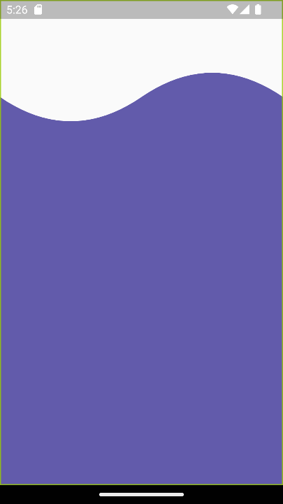

# custom_painter

Disenos personalizados FLutter Custom Painters para Headers

## Appearance Application

<video src='movie-1.mp4' width=180/> | <video src='movie-1.mp4' width=180/>

Fuente: https://www.iteramos.com/pregunta/16559/como-incrustar-un-video-en-github-readmemd?page=2
<video src="appearance/movie-1.mp4">Hola video</video>
<!--  -->
